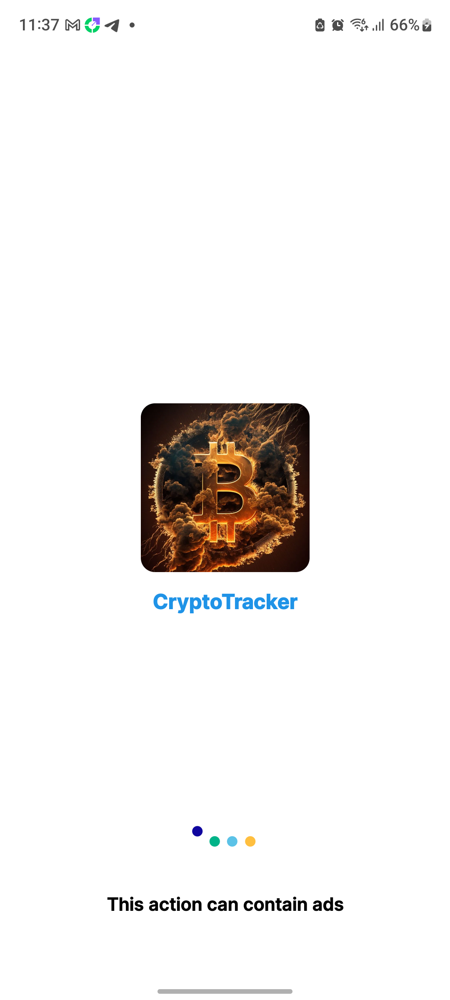
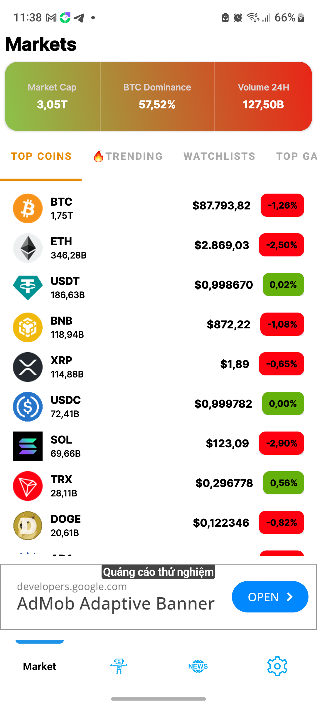
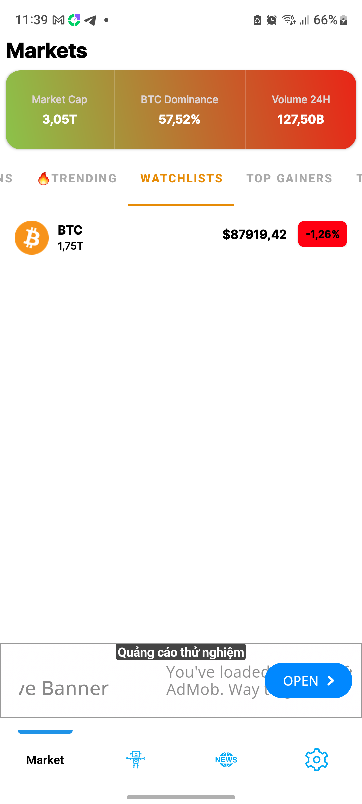
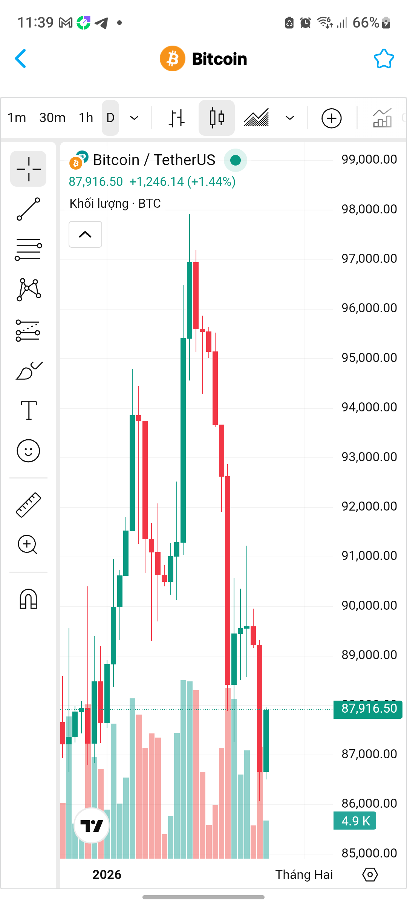
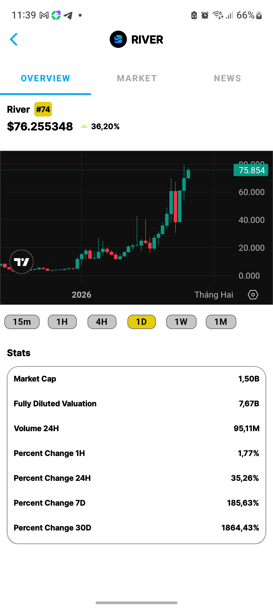
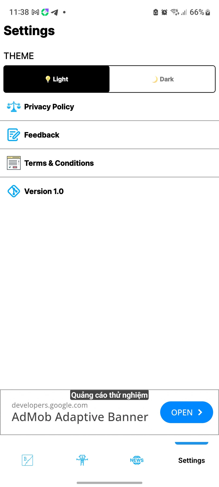

🚀 Crypto Portfolio Tracker

A modern Android application to track, manage, and analyze your cryptocurrency portfolio in real time.  
Built with **Kotlin** and **Clean Architecture** to deliver fast, secure, and user-friendly experiences for crypto investors.

---

## ✨ Features

- 📊 Track crypto assets in real time
- 🔍 Search and add coins to watchlist
- 🤖 AI Chatbot predicts and analyzes tokens
- 📰 News about all types of cryptocurrencies
- 📈 Analyzing the data and information of the coin.
- 🌙 Dark mode support
- 📡 Live market price updates

---

## 🛠 Tech Stack

- **Language:** Kotlin
- **Architecture:** MVVM
- **UI:** XML
- **Async:** Kotlin Coroutines & Flow
- **Network:** Retrofit
- **Dependency Injection:** Hilt
- **Database:** Room
- **API:** Binance / CoinGecko / CoinMarketCap
- **Ads:** AdMob
- **Firebase:** Remote Config, Crashlytics, Analytics

---

## 📸 Screenshots

  
  
  

  
  
  

  
  
  

  

---
